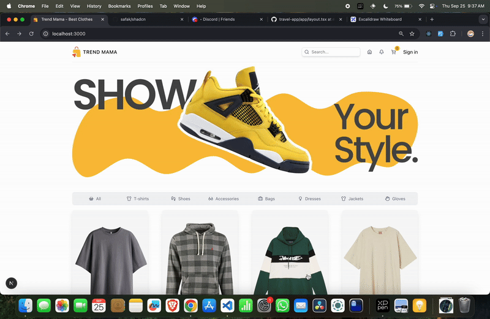

## Trend Mama - Buy now

A modern Nextjs frontend that displays a collection of clothes to shop. This project was built as part of learning NextJS by following the excellent NextJS tutorial by Lama Dev



### Tech Stack

- Nextjs 15 – Modern React/Nextjs features and best practices

- Typescript

- tailwind (ES2025)

- html / CSS

### Setup & Installation

#### Clone the repository:
```bash
git clone https://github.com/nafis-bin/trend-mama.git
cd trend-mama
```
#### Install dependencies:
```bash
npm install
```

#### Start the development server:
```bash
npm run dev
```

#### Credits
Tutorial & Guidance: Lama Dev